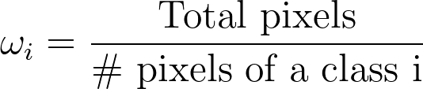

# Homework 3 ELE2765
Homework 3 of Deep Learning class on Electrical Engineering Master's at PUC-Rio

## Introduction

This Project has the objective of learning how a semantic segmentation network works, implementing more specifically U-Net, in a remote sensing dataset. As long as the dataset has a huge imabalance problem we used **weighted cross entropy** loss, which is also implemented in tensorflow 2.x (keras), to handle class imbalance problem. The idea of the project is to compare the results among different trails of the same dataset extracted with different patch sizes, since remote sensing images have a quite big resolution and see how the patch size affects the performance of the network.

The number of pixels by class can be seen on the image below, to show clearly the imabalance problem:

  

The weights calculation of each class for the loss function can be seen below:

  

If this weight calculation doesn't fit for you, you can try a normalized version (the sum of all classes are equal to 1).

## Results

The model hyperparameters of the three trials, can be seen below:

  

### Model histories
We can see an intresting observation in model training histories. As long as we reduce the patch size more noisy is the training:

  

  

  

### Model metrics
Also, looking into the metrics we can see model 1, with the greater patch size, is the best model.

  

  

  

### Model prediction reconstruction
Comparing the reconstructed prediction of each model with the test reference we can see more mispredictions, specifically of class 2 for models 2 and 3.

  

  

  

  

